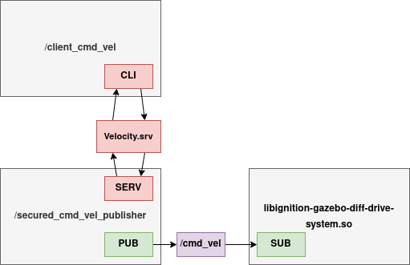
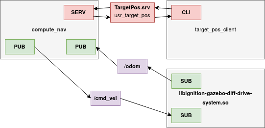
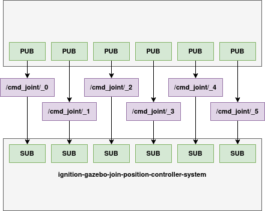
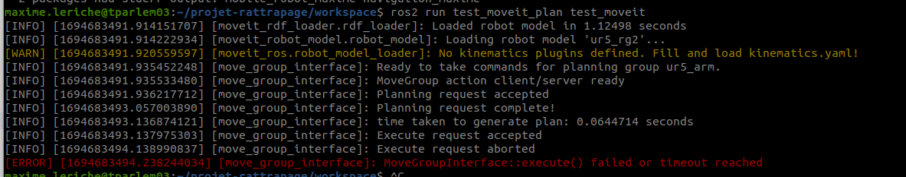
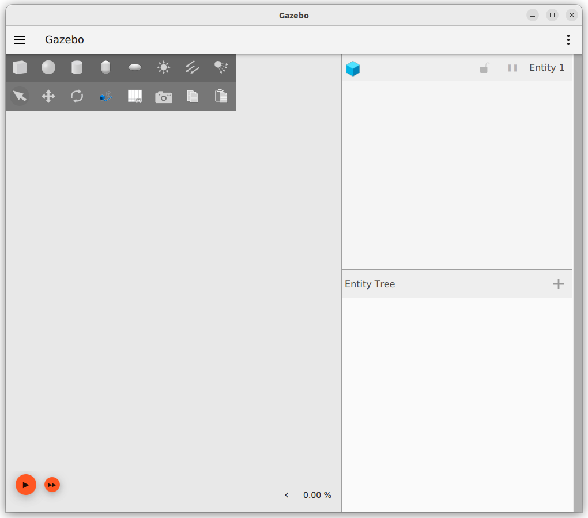

This readme explains how I applied some of the notions I understand from ROS2.

The idea is to generate my own simulation with my own robot. Make some nodes and other routines to have the robot perform some actions. and more to come

tuto ROS2: https://docs.ros.org/en/humble/Tutorials.html \
tuto Gazebo: https://gazebosim.org/docs/harmonic/ros2_integration

For now:
- Simulation on Gazebo with empty world and basic two-wheeled robot + chassis
- Differential driver on the robot (gazebo plugin), used via `/cmd_vel` node to communicate
- Bridge to send commands via ROS2 and not Gazebo
- Publisher to set a default velocity
- Service to set a specific velocity

There are 2 packages:
- (*Python*) **mobile_robot_maxime**: with the simulation and nodes
- (*CMake*) **custom_srv_maxime**: Custom service, and in the future messages

# Versions

**Gazebo**: Fortress (https://gazebosim.org/docs/fortress/getstarted)

**ROS2**: Humble (https://docs.ros.org/en/humble/index.html)

# Basics

How to setup a workspace and a package + my simulation environment

## Create workspace

```shell
mkdir workspace/src
cd workspace/src
```

## Create package (Python) + folders

Create the package and relevant folders

```shell
ros2 pkg create --build-type ament_python mobile_robot_maxime
cd ..
mkdir src/mobile_robot_maxime/launch
mkdir src/mobile_robot_maxime/worlds
mkdir src/mobile_robot_maxime/models/robot
```

## Create .sdf files

Create the SDF files for the world and the robot

```shell
touch src/mobile_robot_maxime/worlds/empty.sdf
touch src/mobile_robot_maxime/worlds/simulation.sdf
touch -p src/mobile_robot_maxime/models/robot/model.config
touch -p src/mobile_robot_maxime/models/robot/model.sdf
```

Then write the SDF definitions

### models/robot/
#### model.config

Model config to give some metadata (not given here)\
http://sdformat.org/tutorials?tut=spec_world&cat=specification&#models-defined-in-other-files

```xml
<?xml version="1.0"?>
<model>
  <version>1.0</version>
  <sdf version="1.4">robot.sdf</sdf>
</model>
```

#### model.sdf

Actual model definition with 2 wheels, a body, and a joint for each wheel attached to the body.

The UR5 arm is taken from https://github.com/gezp/universal_robot_ign/tree/main and included in the robot model.

A joint is added to have the arm fixed on the base.

```xml
<?xml version="1.0" ?>
<sdf version="1.4">
    <model name="robot">
        <link name="base">
            ...
        </link>
        <link name='wheel_L'>
            ...
        </link>
        <joint name='base_L' type='continuous'>
            ...
        </joint>
        <link name='wheel_R'>
            ...
        </link>
        <joint name='base_R' type='continuous'>
            ...
        </joint>
        <!-- Include UR5 arm + fixed joint-->
        <include><uri>model://ur5</uri></include>
        <joint name='join_bras_base' type='fixed'>
            <parent>base</parent>
            <child>ur5</child>
        </joint>
        <!-- Plugins to move the base + control the UR5 joints -->
        <plugin> ... </plugin>
    </model>
</sdf>
```

### worlds/simulation.sdf

Definition of the simulation world, each entity is defined in `models/` and included in `simulation.sdf`

```xml
<?xml version="1.0" ?>
<sdf version="1.4">
    <world name="simple_world">
        <include>
            <uri>model://ground</uri>
        </include>
        <include>
            <uri>model://light</uri>
        </include>
        <include>
            <uri>model://robot</uri>
        </include>
    </world>
</sdf>
```
The entites are:
- Ground
- Light
- The robot

#### Problem with `<uri>`

Need to set the environment variables to use `model://` in `<uri>`\
https://answers.ros.org/question/380288/best-way-to-add-packages-models-path-to-gazebo_model_path-in-ros2/ \
https://gazebosim.org/api/gazebo/6.1/migrationsdf.html

In `package.xml`:
```xml
<exec_depend>gazebo_ros</exec_depend>
...
<export>
    <gazebo_ros gazebo_model_path="${prefix}/models"/>
    ...
</export>
```

But it doesn't work, so I give up for now (7 SEP 2023) and in `empty.sdf` put the content of `<model>` from `robot.sdf` instead of `<include>`

## Plugins

### World plugins

- **libignition-gazebo-imu-system.so**: Adds a sensor (to be placed in a link) to get acceleration

Added to the base link:

```xml
<sensor name="imu_sensor" type="imu">
    <always_on>1</always_on>
    <update_rate>1</update_rate>
    <visualize>true</visualize>
    <topic>imu</topic>
</sensor>
```

Run to see what message is going in the `imu` topic
```shell
ign topic -e -t /imu
```

### Robot base plugins

- **libignition-gazebo-diff-drive-system.so**: Help control the robot

Send a frame to the diff_drive_system via the `cmd_vel` topic defined in the plugin:

```shell
ign topic -t "/cmd_vel" -m ignition.msgs.Twist -p "linear: {x: 0.5}, angular: {z: 0.05}"
```

### UR5 plugins

- **ignition-gazebo-joint-position-controller-system**: To control a joint. There is one for each joint of the arm (6 total)

```shell
ign topic -t "<topic_name>" -m ignition.msgs.Double -p "data: 1.0"
```

This plugin sets up a topic to communicate which seems to not work properly because of a topic name invalid format (https://github.com/gazebosim/gz-sim/issues/447) but a fixed has been made to allow the `<topic>` tag (https://github.com/gazebosim/gz-sim/pull/584/files#diff-20a45606395d74763bf5447fbd993cfd45d918d47f6e7defa0b52c9fb6d16512)

- **ignition-gazebo-joint-state-publisher-system**: To publish joint state as `ignition.msgs.Model` on `/world/simple_world/model/robot/model/ur5/joint_state`

## Start simulation

Because the models are included via `<uri>` tags referencing `models://`, we need to setup the environment variable `$IGN_GAZEBO_RESOURCE_PATH` before starting the simulation.

This can be done in the `.bashrc` or via a launch file:

```py
def generate_launch_description():
    return LaunchDescription([
        SetEnvironmentVariable(name='IGN_GAZEBO_RESOURCE_PATH', value=os.getcwd() + '/src/mobile_robot_maxime/models'),
        ...
    ])
```

# Package custom_srv_maxime

Used to define custom service structures.

For non standard messages, need to specify the package in the `.srv` file e.g.

```
geometry_msgs/Point target_pos
---
float64 distance
```

Fill the comments in `CMakeList.txt`:

```cpp
find_package(ament_cmake REQUIRED)
find_package(rosidl_default_generators REQUIRED)
/// + any other package used for the messages types

rosidl_generate_interfaces(${PROJECT_NAME}
    /// "path_to_the_srv_file"
    DEPENDENCIES 
    /// + any other dependency used for the messages types
    rosidl_default_generators
 )
```

and in `package.xml`

```xml
  <exec_depend>rosidl_default_runtime</exec_depend>
  <member_of_group>rosidl_interface_packages</member_of_group>

  <buildtool_depend>ament_cmake</buildtool_depend>
  <!-- <depend>dependencies</depend> -->
  <build_depend>rosidl_default_generators</build_depend>
```

## `Velocity.srv`

- Request is a linear velocity along the X axis, and an angular velocity along the z axis.
- Response is the corresponding `Twist` command
```
float64 linear
float64 angular
---
geometry_msgs/Twist command
```

Because it uses `Twist` message from `geometry_msgs`, need to add in `CMakeList.txt`:

```cpp
find_package(geometry_msgs REQUIRED)

rosidl_generate_interfaces(${PROJECT_NAME}
  "srv/Velocity.srv"
    DEPENDENCIES 
    geometry_msgs
 )
```

and in `package.xml`

```xml
  <depend>geometry_msgs</depend>
```

## `TargetPos.srv`

- Request is a position
- Response is the distance and angle difference between the estiamted position and orientation of the robot and target.

```
geometry_msgs/Point target_pos
---
float64[] vector_angle
```


# Communicate with Gazebo via ROS2

Messages can be sent directly via Gazebo:
```shell
ign topic -t "<topic_name>" -m <ign_message_type> -p "<content>"
```

To control the robot with ROS2, there needs to be a bridge between Gazebo and ROS2.\
`ros_ign_bridge` creates the bridges (apprently deprecated and automatically redirects to `ros_gz_bridge`)

The bridge connects the two interfaces given a direction (can be both) for a specific topic, and the message types need to be given

Example:
- topic_name: `cmd_vel`
- ros2_message_type: `geometry_msgs/msg/Twist`
- ign_message_type: `ignition.msgs.Twist`

```shell
ros2 run ros_ign_bridge parameter_bridge <topic_name>@<ros2_message_type>SPECIAL_SYMBOL<ign_message_type>
```

Communication direction is given by `SPECIAL_SYMBOL`:
- `]` is a bridge from ROS2 to Gazebo
- `[` is from Gazebo to ROS2
- `@` is bidirectional

All the possible bridge messages are here: https://github.com/gazebosim/ros_gz/tree/ros2/ros_gz_bridge

*Note: this can also be done with embedding directly in the .sdf file, but not explored here*

## Try it

- Start simulation + create bridge
```shell
ros2 launch mobile_robot_maxime vanilla.launch.py
```

- Listen to Gazebo topic side
```shell
ign topic -e --topic /cmd_vel
```

- Send a frame
```shell
ros2 topic pub --once /cmd_vel geometry_msgs/msg/Twist "{linear: {x: 0.5, y: 0.0, z: 0.0}, angular: {x: 0.0, y: 0.0, z: 0.0}}"
```

# Examples with the differential driver

## CLI

- Start simulation + create bridge
```shell
ros2 launch mobile_robot_maxime vanilla.launch.py
```

- Publish something in the bridge in CLI
```shell
ros2 topic pub --once /cmd_vel geometry_msgs/msg/Twist "{linear: {x: 0.5, y: 0.0, z: 0.0}, angular: {x: 0.0, y: 0.0, z: 0.0}}"
```

## Publisher

Example to publish a message to the robot.

Launch file to start the Gazebo simulation, the bridge with ROS2, and the publisher node:

```shell
ros2 launch mobile_robot_maxime example_publisher.launch.py
```

## Node secured_cmd_vel_publisher

`mobile_robot_maxime.secured_cmd_vel_pub.py`

### Definition

The node publishes a command continuously to the topic `/cmd_vel` which allows to pilot the base (via a bridge when running a Gazebo simulation), with a default value of zero to force a safe state when communication is cut for example, or a specific value coming from a service when the system - or the user - sends a velocity command.

### Interface

The node is interfaced:
- With the robot via the topic `/cmd_vel` using `Twist` messages
- With the rest of the system via the service `/usr_cmd_vel` using `Velocity.srv`

`geometry_msgs/msg/Twist`:
```
Vector3  linear
	float64 x
	float64 y
	float64 z
Vector3  angular
	float64 x
	float64 y
	float64 z
```

`Velocity.srv`:
```
float64 linear
float64 angular
---
geometry_msgs/Twist command
```

### Details

The node publishes a `Twist` message via the `/cmd_vel` topic at a given rate (`$TIMER_PERIOD`).\
The message contains linear (x axis) and angular (z axis) velocities for the robot.

The default value published is:
```cpp
geometry_msgs.msg.Twist(linear=geometry_msgs.msg.Vector3(x=0.0, y=0.0, z=0.0), angular=geometry_msgs.msg.Vector3(x=0.0, y=0.0, z=0.0))
```
Which corresponds to no movement, therefore a safe state.

When a request comes, the published value is changed to correspond to the service request `Velocity.srv`:
- The request corresonds to target linear and angular velocities for the x axis
- The response is the corresponding `Twist` message

The response is used to acknowledge the request here and update the published value, sent a certain amount of times (`$SECURED_ITERATIONS`) before going back to the safe default value.

### Diagram

Usage in `secured_node_usr.launch.py`



### How to use it

Launch file to start the Gazebo simulation, the bridge with ROS2, and the node:
```shell
ros2 launch mobile_robot_maxime secured_node_usr.launch.py
```

Send a velocity command:
```shell
ros2 run mobile_robot_maxime send_cmd_vel linear_x angular_z
```

# Robot navigation from A to B

The topic `/model/robot/odometry` provides the position and orientation of the robot (approximatively).
Computes the angle difference to the target, reduces it to zero, then move towards the target, until the distance is zero.

In practice the thresholds are not zero but 0.1.

Cannot work, odometry on orientation is terrible and introduces $\pi/2$ error in the first $2\pi$ rotation...\
Position is just as wrong...

```shell
ros2 launch navigation_maxime test.launch.py
```
```shell
ros2 run navigation_maxime compute_nav
```
```shell
ros2 run navigation_maxime send_target_pos 2 2
```


I guess nav2 can do the exact same thing but with the sensors data.

# Pilot the UR5 arm

Each joint is connected to a topic `/joint_cmd/<joint_name>`
- joint_name: _0 to _5

The joints take a `ignition.msgs.Double` (or `std_msgs/msg/Float64` via ROS2 bridge) that corresponds to a position in rad.

Besides `elbow_joint` which is bound between $[-\pi;+\pi]$, all joints take values between $[-2\pi;+2\pi]$

How to control the end effector to go to a given position? MoveIt can do it but I don't know how to use it, how to implement it in a ros2 project, etc.

```shell
ros2 topic pub --once /cmd_joint/_0 stds_msgs/msg/Float64 "{data: 1.0}"
```

## MOVEIT

Do all the configurations with the Wizard to generate the necessary files and information to control the joints, use IK, etc.

Then you can use MOVEIT, load the configurations, and it can control the joints properly given a command (multiple possibilities, see this [example](https://github.com/ros-planning/moveit2_tutorials/blob/main/doc/examples/motion_planning_python_api/scripts/motion_planning_python_api_tutorial.py) for 5 ways of planning and executing a movement)

Now some nodes are launched by the demo.maunch.py file:
- MoveGroup? MoveGroupInterface?
- JointTrajectoryController?
- Launch file very unclear, and absolutely no information on what exactly is going on...

## Naive example

Example node to move the arm in a random position every 2s, may end up upside down.

```shell
ros2 launch mobile_robot_maxime with_arm_gazebo.launch.py
ros2 run mobile_robot_maxime breakdance
```



The top node sends random values to the joint controllers.

## MoveIt problems

Still exploring MoveIt to use it as ros node.\
No idea how to configure everything in Gazebo either.

### URDF file

Found a URDF + SDF descriptions of the UR5: https://github.com/AndrejOrsula/ur5_rg2_ign/blob/master/urdf/ur5_rg2.urdf
- Need to change the mimic name in the urdf for the grip fingers.

### Wizard

The MoveIt Wizard starts, sometimes crashes in the middle, but it creates the configuration files and package
This tutorial applied to the description: https://moveit.picknik.ai/main/doc/examples/setup_assistant/setup_assistant_tutorial.html?highlight=setup

### Demo file

Many errors, process crashing, etc. And the robot does not load.\
For some reasons we need to add `LC_NUMERIC=en_US.UTF-8` before launching to have the robot loaded (https://github.com/ros-planning/moveit2/issues/1049)
```shell
LC_NUMERIC=en_US.UTF-8 ros2 launch moveit_ur_with_hand demo.launch.py
```
### MoveIt integration in a node

Run demo file + the node in question (`test_moveit_plan/src/test_moveit.cpp`)



My guess is if this works, I can command the arm to place the ee at the spatial position I want communicating with that node.\
Transfer to Gazebo sim? No idea

### MoveIt python

The package is not installed (https://github.com/ros-planning/moveit2/tree/main/moveit_py) and cannot use it with source install either, moveit does not build, and moveit_py does not seem to provide the python module moveit.planning and such (https://moveit.picknik.ai/main/doc/api/python_api/api.html)

# Problems

Gazebo not starting the simulation\


# Launch files

Modular launch files to start simulation, spawn a robot, start a node, etc.

Could have default launch param description with a .yaml and
```py
config_path = os.path.join(
    get_package_share_directory(PKG_NAME), "config", CONFIG_FILE
)
with open(config_path, "r") as file:
    configParams = yaml.safe_load(file)
```

## Tips

- Don't add blank spaces before model names to save (a lot of) time

## YAML

Could use .yaml in `/config` to pass default arguments
- Give the robot name and position in .yaml

## default.launch.py

Starts the basic elements to run a Gazebo simulation

- Sets environment variables to find the models
- Calls default launch file from `ros_gz_sim`
- Spawn the given robot via `DeclareLaunchArgument` or the mobile base + UR5 arm by default.

Could add parameters to spawn the robot at a given position

## cmd_vel_pub.launch.py

Calls `default.launch`, defines which robot to spawn (could add robot model path as parameter), and starts basic node to have the robot run in circle (could add the values as parameters as well)

